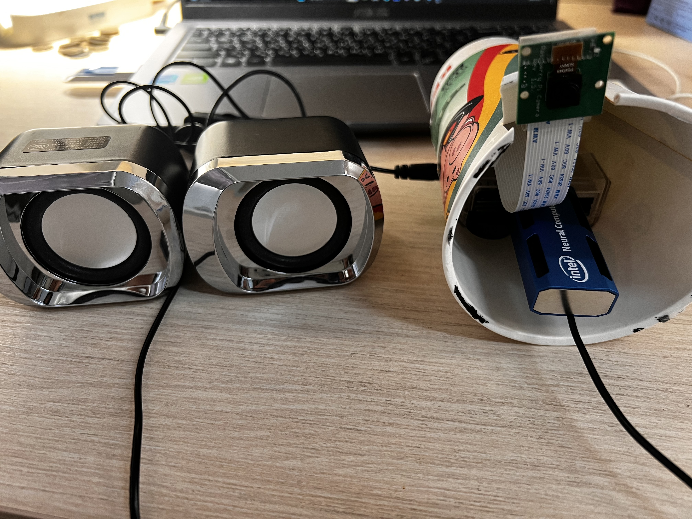
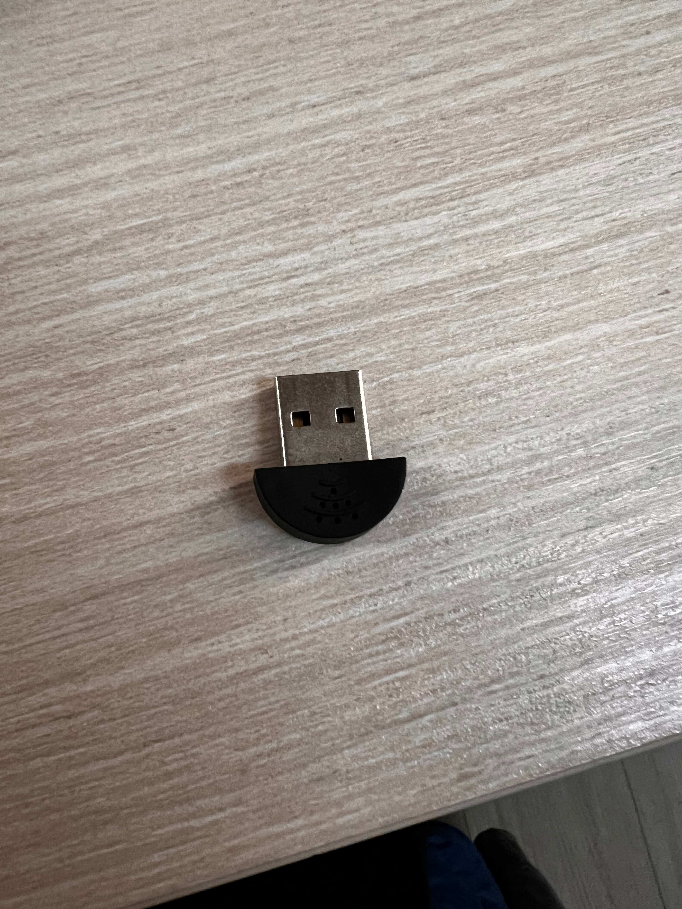

# IoT_盲人行走輔助系統
作者:111403553 林祐霆

---

## 專案簡介
這個裝置利用樹梅派(Raspberry pi)代替使用者的眼睛，幫助盲人可以更加清楚的感知周遭人、車的距離，並利用gTTS回傳語音。裝置考慮到使用者的不方便，所以只需要確保裝置連上網、插上電，裝置就會開始運作。
該裝置根據使用方式大致可以分成語音指令區、行人輔助區、報平安區。
## 裝置照片

## 程式碼功能介紹
1. voice_controal(語音指令區):
- 該程式碼使用usb麥克風並負責處理盲人使用者的語音指令，根據對應到的語音切換至不同功能區域:
    - 啟動/關閉行人輔助(進入safety_support)
    - 我出發了/我已經安全到達(進入sending_Line)
- 語音指令是一直在運行的，不論進到哪個程式碼!因此執行safety_support時，需要用thread(並行序列)來保證不會阻擋語音指令功能
    ```
    threading.Thread(target=run_safety_support, daemon=True).start()  # 啟動safety_support的序列
- 
2. safety_support(行人輔助區):
- 該程式碼負責辨認人、車並計算距離，是該裝置的核心。
- 會將偵測到的物體名稱、距離整合成一個簡短的文字稿並傳給voice_output(輸出語音)
- 一旦偵測到人、車，該程式碼會依據現實高度(預設人:1.6公尺，車:1.5公尺) X 相機焦距(設為200) / 偵測到的像素高度(px) = 距離估計(公尺)
    ```
    obj_dis = calculate_distance(obj_h, obj_name[1],FOCAL_LENGTH)  # 計算距離
   def calculate_distance(object_height_px, actual_height,FOCAL_LENGTH):
    """計算物體與相機的距離"""
    if object_height_px > 0 and actual_height is not None:
        return round((actual_height * FOCAL_LENGTH) / object_height_px)
    return -1  # 無法計算距離
- 影像的部分設定成每5個frame後再推論，這樣可以有效的降低推理的frame太舊的情況發生。注:如果每個frame都給模型推論，就會出現:當裝置偵測到人後，即使使用者立刻把鏡頭蓋住，但是語音卻不斷說裝置偵測到人，這是因為一瞬間推理了許多frame並生成許多文字稿給voice_output，導致推理結果和語音輸出堆積，產生延遲的結果。
    ```
    frame_skip = 5 # 5個frame後再推論
    frame_count = 0
    while running:
            ret, frame = cap.read()
            current_time = time.time()
            if not ret:
                print("無法讀取影像")
                break
            frame_count+=1
            if frame_count % frame_skip != 0:
                continue
- 如果鏡頭前同時出現許多人、車，該程式碼會優先產生距離最近的文字搞
    ```
    nearest_alert = None
    min_dis = float('inf') #正無窮大
    for detection in detections:
    ....
        if obj_dis < min_dis: #選擇距離近的
            min_dis = obj_dis
            nearest_alert = f"有{obj_name[0]}在{position}, 距離約 {obj_dis:.2f} 公尺"
- 為了避免對一樣的物件生成重複的語音文字稿，對照前一個文字稿進行判斷
    ```
    if nearest_alert and nearest_alert != last_alert:
    print(nearest_alert)
    vo.play_tts(nearest_alert)
    last_alert = nearest_alert
- 最後自訂一個stop()，用來關閉相機、NCS2等等資源
    ```
    def stop():
        global compiled_model 
        global running
        global cap
        running = False
        if cap is not None:
            cap.release()
            cap = None
        cv2.destroyAllWindows()
        if compiled_model is not None:
            del compiled_model #刪除編譯模型
            complied_model = None
3. sending_Line(報平安區):
- 該功能主要是作為可持續追蹤、紀錄現在這位盲人使用者的狀態，透過使用者傳Line給綁定用戶的方式確保使用者是否出發/安全抵達。
    ```
    import requests
    def sending(message):
        # LINE Notify 權杖
        token = 'YOVvCxxm1zlCP3dr3zTEl0brQTTFgFcfRi4oaHBR0MV'
        # 要發送的訊息
        # HTTP 標頭參數與資料
        headers = { "Authorization": "Bearer " + token }
        data = { 'message': message }
        # 以 requests 發送 POST 請求
        requests.post("https://notify-api.line.me/api/notify",
            headers = headers, data = data)
        return
- 
4. voice_output:
- 利用gTTS將傳入的文字稿轉換成中文語音，最終由os撥放、刪除音檔
    ```
    tts = gTTS(text=text, lang='zh-TW')
    tts.save("alert.mp3")
    os.system("mpg321 alert.mp3")
    os.remove("alert.mp3")

## 示意圖

---

## 專案軟體需求
- Python 3.7.9
- gTTS 2.5.4
- Openvino_2022.3.2
- OpenCV 4.5.2-openvino
- numpy 1.19.5
- SpeechRecognition
- ssdlite_mobilenet_v2/FP32(將模型轉換成openvino的格式)

### 軟體安裝流程
1. 安裝CMack
    ```
    cd ~/
    wget https://github.com/Kitware/CMake/releases/download/v3.14.4/cmake-3.14.4.tar.gz
    tar xvzf cmake-3.14.4.tar.gz
    cd ~/cmake-3.14.4
    ./bootstrap
    make -j4
    sudo make install
2. 安裝OpenCV
    ```
    cd ~/
    sudo apt install git libgtk2.0-dev pkg-config libavcodec-dev libavformat-dev libswscale-dev libatlas-base-dev python3-scipy
    git clone --depth 1 --branch 4.5.2-openvino https://github.com/opencv/opencv.git
    cd opencv && mkdir build && cd build
    cmake –DCMAKE_BUILD_TYPE=Release –DCMAKE_INSTALL_PREFIX=/usr/local ..
    make -j4
    sudo make install
3. 安裝OpenVino(如果指令不行，可以上網下載)
    ```
      wget https://storage.openvinotoolkit.org/repositories/openvino/packages/2022.3.2/l_openvino_toolkit_debian9_2022.3.2.9279.e2c7e4d7b4d_armhf.tgz
- 解壓縮((如果指令不行，可以手動解壓縮)
  ```
  tar -xvf l_openvino_toolkit_debian9_2022.3.2.9279.e2c7e4d7b4d_armhf.tgz 
- 執行 OpenVINO 提供的腳本來安裝所需依賴項：
  ```
  sudo /home/user/intel/openvino_2022.3.2/install_dependencies/install_openvino_dependencies.sh
- 執行以下腳本來設置 USB 規則，確保 Movidius NCS2 可用：
  ```
  sudo /home/YaHaaaa/intel/openvino_2022.3.2/install_dependencies/install_NCS_udev_rules.sh

4. 安裝物件辨識模型：這邊建議先在筆電下載、google colab轉換ssdlite_mobilenet_v2模型，避免樹梅派環境衝突 [ssdlite_mobilenet_v2](https://github.com/openvinotoolkit/open_model_zoo/blob/master/models/public/ssdlite_mobilenet_v2/README.md)
5. [轉換時需要使用 OpenVINO Model Optimizer](https://medium.com/ching-i/intel-openvino-%E6%A8%A1%E5%9E%8B%E8%BD%89%E6%8F%9B-tensorflow-darknet-yolo-onnx-cfc9f2260e7f)
6. 設定啟動文件(讓樹梅派一連網、插電就可以用):
- 編輯啟動腳本：
   ```
    nano /home/user/autostart.sh
- 在腳本中添加以下內容，將路徑替換為實際路徑：
  ```
  #!/bin/bash
  sleep 30  # 等待30秒，確保插電後gTTS來得及連上網路
  source /home/user/intel/openvino_2022.3.2/setupvars.sh>> /home/user/autostart.log 2>&1
  python3 /home/user/IoT_final/voice_controal.py>> /home/user/autostart.log 2>&1
- 給腳本添加執行權限：
  ```
  chmod +x /home/user/autostart.sh
- 重啟樹莓派：
  ```
  sudo reboot
## 專案硬體需求
 - Raspiberry pi 4代主機板
 - SD Card 32GB (16GB may work)
 - Raspiberry pi camera
 - NCS2 神經運算棒
 - 5v行動電源 1 顆
 - usb-typeC充電線一條
 - usb麥克風
 - 電腦音箱(3.5mm插孔)
## 可以改進的地方
- sending_Line目前只能傳訊息，可以加上接收訊息的部分，再透過voice_output輸出
- 語音輸入時需要確保當下環境是安靜的，可以優化麥克風收音效果，或是設定成按一下按鈕後才開始收音
- 裝置的外型太簡略，可以再優化

## 影片demo
- [語音功能、sending_Line功能展示](https://studio.youtube.com/video/x_t_HDDhLwU/edit)
- [行人輔助區_距離估算展示](https://youtube.com/shorts/be-8oqUC6o8)
## 參考網址
[估算距離公式](https://blog.cavedu.com/2019/07/04/distance-of-the-person/)
[openvino轉換模型](https://medium.com/ching-i/intel-openvino-%E6%A8%A1%E5%9E%8B%E8%BD%89%E6%8F%9B-tensorflow-darknet-yolo-onnx-cfc9f2260e7f)
[Line的權杖設定](https://yaocaptain.com/p/python-line-notify/)
[語音輸入](https://ithelp.ithome.com.tw/m/articles/10308396)
